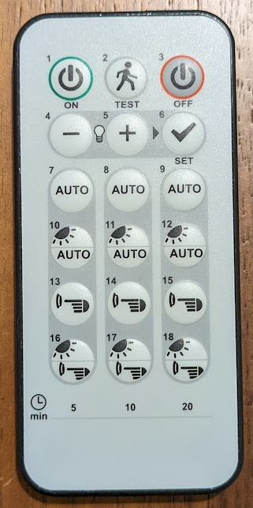

# WARNING

This is currently broken
I tested the captured IR codes and they don't actually work. Not sure why, for some reason the flipper-zero capture and replay doesn't reproduce the data well enough to actually operate the light controllers.

TODO: get working captures

# How to control Ex-or LightSpot controllers with IR

These light controllers are sometimes known by other names:

- Ex-or LightSpot
- Honeywell light controller
- PEHA light controller (possibly, I only see that name on the remote, and the honeywell site doesn't clarify what PEHA actually is)

## Option 1: Buy this

This is an IR remote that you can buy from Honeywell suppliers. It's normally way more expensive than you'd like.

It goes by various names
- HP18 LightSpot Programmer (according to the [user manual](HP18_user_manual.pdf))
- DHP 18 IR Remote Programmer (according to the sticker on the device)
- PH00988483 (also according to the sticker on the device)

It takes a CR2023 cell.

## Option 2: Flipper zero IR files

This repo contains the flipper zero IR files for controlling Ex-or LightSpot via infra-red.

See the file called [ExOr_lights.ir](ExOr_lights.ir)
